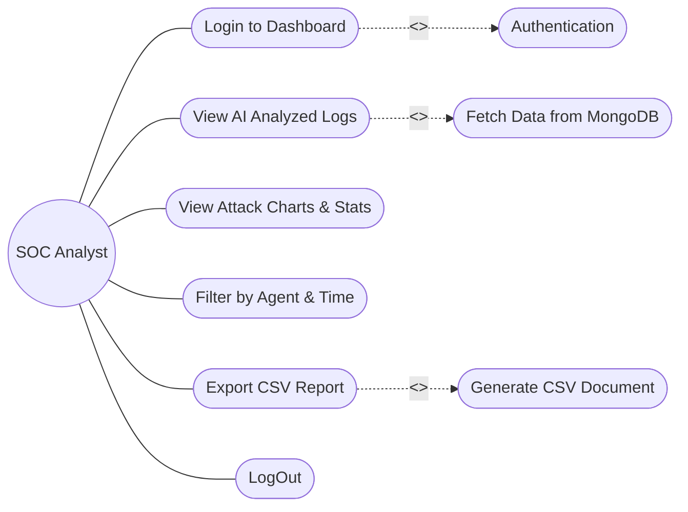
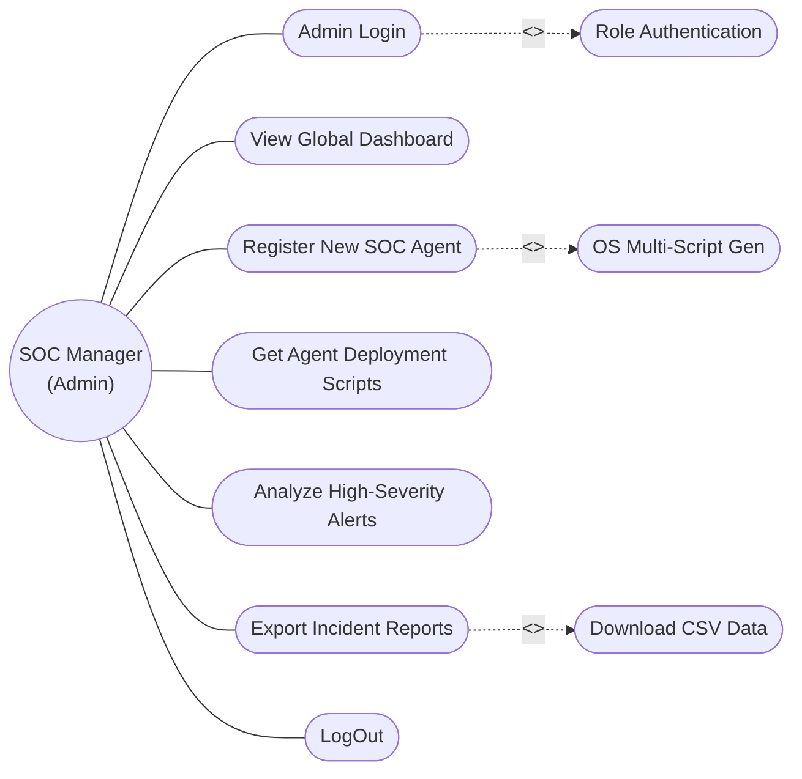
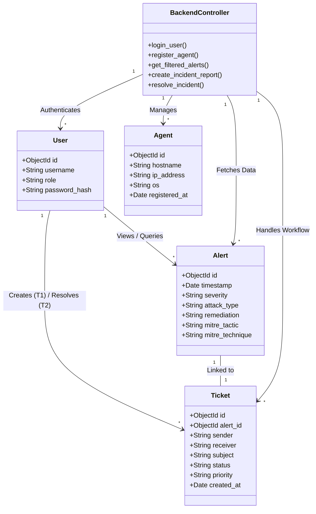
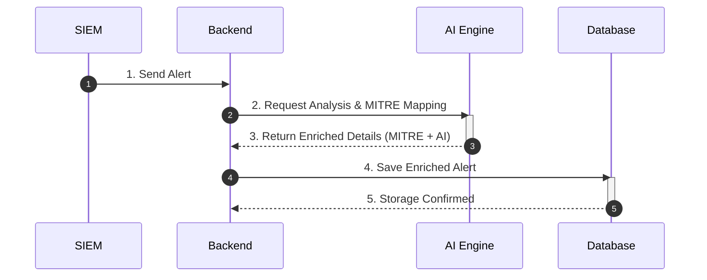
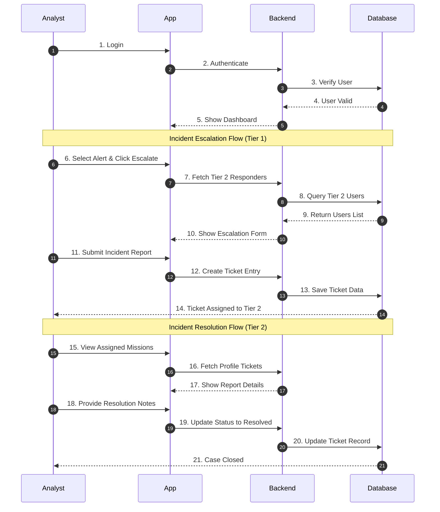

# BlueGuard - College Project Architecture Diagrams

*Tip: You can copy and paste the ````mermaid ```` code blocks into websites like [Mermaid Live Editor](https://mermaid.live) or use a VS Code Markdown preview extension to instantly render these as images for your PPT.*

---

## 1. Use Case Diagram (SOC Analyst - Restricted)
*(Yeh diagram dikhata hai ki ek regular analyst kya-kya kar sakta hai)*



---

## 2. Use Case Diagram (SOC Manager - Administrative)
*(Yeh diagram dikhata hai ki Manager ke paas Agent management ki extra permissions hai)*



---

## 2. Class Diagram



---

## 3. Activity Diagram

```mermaid
%%{init: {'flowchart': {'nodeSpacing': 100, 'rankSpacing': 100}}}%%
flowchart TD
    %% Start
    StartNode(( )) ---|Start| Login[LOGIN]
    
    %% Authentication Loop
    Login --> Auth{Authentication}
    Auth -- "Invalid" --> Login
    
    %% Fork (Parallel Branching - Horizontal Bar)
    Auth -- "Valid" --> Fork[ ]
    style Fork fill:#000,stroke:#000,stroke-width:10px
    
    Fork --> UC1[View SOC Dashboard]
    Fork --> UC2[Analyze AI Logs & MITRE Mapping]
    Fork --> UC3[Filter by Time/Agent]
    Fork --> UC4[Manage Incident Tickets]
    Fork --> UC5[Manage Agents]
    
    %% Join (Merging Branches - Horizontal Bar)
    UC1 --> Join[ ]
    UC2 --> Join
    UC3 --> Join
    UC4 --> Join
    UC5 --> Join
    style Join fill:#000,stroke:#000,stroke-width:10px
    
    %% End Flow
    Join --> Logout[Logout]
    Logout --> EndNode((( )))
---

## 6. Database Schema Design (MongoDB Collections)
*(Yeh tables dikhate hain ki hamara database alerts aur users ka data kis format me store karta hai)*

### Table 1: Users Collection
*(User authentication aur role-based access ke liye)*

| Field Name | Data Type | Description |
| :--- | :--- | :--- |
| **_id (PK)** | ObjectId | Unique identification for each user |
| **username** | String | Unique login name of the analyst/manager |
| **password** | String | Securely hashed password string |
| **role** | String | User role (SOC Manager / SOC Analyst) |
| **created_at** | Datetime | Timestamp when the user was registered |

<br>

### Table 2: Alerts Collection
*(SIEM logs aur AI enrichment data store karne ke liye)*

| Field Name | Data Type | Description |
| :--- | :--- | :--- |
| **_id (PK)** | ObjectId | Unique identification for each alert |
| **timestamp** | Datetime | The exact time when the attack occurred |
| **severity** | String | Threat level (Critical, High, Medium, Low) |
| **attack_type** | String | AI-classified name of the attack |
| **agent_name** | String | Hostname of the compromised machine |
| **rule_desc** | String | Original description from Wazuh SIEM |
| **analysis** | String | AI-generated deep analysis of the threat |
| **remediation** | String | Steps suggested by AI to fix the issue |
| **mitre_tactic** | String | MITRE ATT&CK Tactic (e.g. Credential Access) |
| **mitre_technique** | String | MITRE Technique ID & Name (e.g. T1110) |

<br>

### Table 3: Agents Collection
*(Registered monitors aur endpoints ki details ke liye)*

| Field Name | Data Type | Description |
| :--- | :--- | :--- |
| **_id (PK)** | ObjectId | Unique identification for each agent |
| **hostname** | String | Name of the endpoint machine |
| **ip_address** | String | Network IP of the registered agent |
| **os_type** | String | Machine OS (Windows, Ubuntu, CentOS) |
| **status** | String | Current deployment status (Active/Pending) |
| **registered_at** | Datetime | Date and time of agent registration |

<br>

### Table 4: Tickets Collection
*(Incident reporting aur collaborative response workflow ke liye)*

| Field Name | Data Type | Description |
| :--- | :--- | :--- |
| **_id (PK)** | ObjectId | Unique identification for each ticket |
| **alert_id (FK)** | ObjectId | ID of the linked security alert |
| **sender** | String | Username of the Tier 1 Analyst |
| **receiver** | String | Username of the Tier 2 Responder |
| **subject** | String | Incident Title/Subject |
| **observations** | String | Detailed notes from Tier 1 analyst |
| **resolution_notes** | String | Final report from Tier 2 responder |
| **status** | String | Current state (Pending/Investigating/Resolved) |
| **priority** | String | Severity level (Critical/High/Medium/Low) |
| **created_at** | Datetime | Timestamp when the ticket was created |
```
---

## 4. Sequence Diagram 1: Automated Threat Intelligence Pipeline
*(Yeh diagram dikhata hai ki system bina user ke alert kaise process karta hai)*



---

## 5. Sequence Diagram 2: Analyst Investigation & Reporting
*(Yeh diagram dikhata hai ki User dashboard se kaise interact karta hai)*


