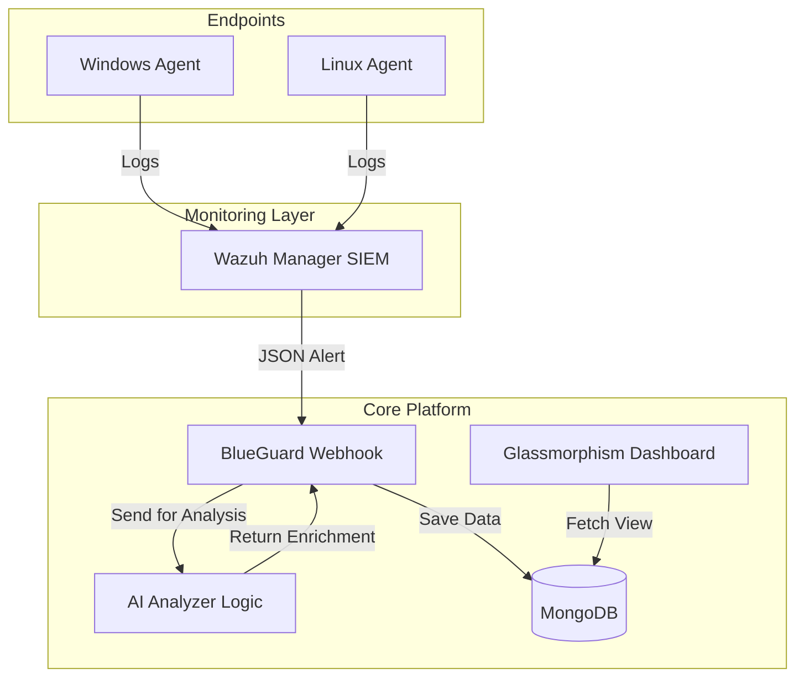

# BLUEGUARD - AI-Assisted SOC Monitoring Platform 🛡️🤖

[](https://wazuh.com/)
[](https://deepmind.google/technologies/gemini/)
[](https://attack.mitre.org/)

**BlueGuard** is a robust, enterprise-grade Security Operations Center (SOC) dashboard designed to receive, analyze, and visualize security alerts from a Wazuh SIEM lab environment. It leverages Advanced AI to classify threats and maps them to the global **MITRE ATT&CK** framework, providing SOC analysts with real-time actionable intelligence.

## 🚀 Key Features

- **Live Threat Stream:** Real-time alert ingestion from Wazuh agents.
- **AI-Driven Enrichment:** Automated classification, risk analysis, and remediation steps using Gemini AI.
- **MITRE ATT&CK Mapping:** Automatic technique detection (e.g., T1110) for standardized classification.
- **Incident Response Unit (Mission Control):** A tier-based ticketing system where Tier 1 analysts escalate to Tier 2 responders.
- **Professional Dashboard:** Visual charts for Attack Trends, Severity Distribution, and IR Performance.
- **File Integrity Monitoring (FIM):** Advanced detection of unauthorized file changes and deletions.
- **Security Hardening:** Robust input validation and server-side sanitization.

## 🏗️ Architecture



## 🛠️ Technology Stack

- **Backend:** Python (Flask)
- **Database:** MongoDB
- **Security Logic:** AI-Assisted (OpenRouter/Gemini API)
- **Frontend:** HTML5, Vanilla CSS, TailwindCSS (Utility-first styling)
- **Integration:** Wazuh SIEM Webhooks

## 📦 Installation & Setup

1. **Clone the repository:**
   ```bash
   git clone https://github.com/YOUR_USERNAME/BlueGuard.git
   cd BlueGuard
   ```

2. **Initialize Environment:**
   ```bash
   python -m venv venv
   ./venv/Scripts/activate (Windows)
   pip install -r requirements.txt
   ```

3. **Configure Environment Variables:**
   - Create a `.env` file based on the template.
   - Add your `OPENROUTER_API_KEY` and MongoDB URI.

4. **Run Platform:**
   ```bash
   python app.py
   ```

## 📄 Documentation

Check `/docs` or the **Project_Presentation_Diagrams.md** file for a full set of architecture, class, and sequence diagrams suitable for academic presentation.

---
**Maintained by:** [Analyst Harsh Patel]  
*Built for College Presentation excellence.*
